## AWS VPC
### NETWORKING
### Network is a system that allows multiple device to communicate with one another. Imagine you have devices like computer, printer, TV and so on. When devices are conected in a network, they are able to share information between one another. For instance sending document to a printer, streaming a youtube video online.

In an office settings, you have wall ports where each devices are connected to, then each of these wall port connected to the patch panel. This is also called server rack, its just a neat row of ports that helps organize network cables. Then from the patch panel, another Ethernet cable connects to a network switch. The switch is like a traffic roundabout, efficiently directing data to the correct destination. The switch connects multiple devices and allows them to communicate. It sends data only to the intended device instead of broadcasting it everywhere

Devices can also be connected wirelessly. A common way to do this is with a wireless access point, using wiFi. This wireless access point is like the network switch here but doesnt use cables.

So whether wired or wireless, the goal is for devices to be able to send and receive information. For this to happen, the sender and receiver both need to understand eachother, they both need to speak thesame language. In networking, speaking thesame language means they both ned to agree on how data is being sent, received, organized and handled. This language they speak is called a **Protocol**

## What is VPC, Subnets, Internet Gateway and NAT Gateway

You can imagine building a virtual space for the company, olapro.xyz so that the computers can communicate securely, Thats what VPC or Virtual Private Cloud is all about. Its like creating a private room in the cloud just for olapro.xyz's use.

**Example:** Think of olapro.xyz like a office building. Inside this building there are odifferent departments like HR, Finance, and IT.Each department has its own area with specific access rules. Similarly, in a VPC, olapro.xyz can create different sections called subnets, for different parts of the business. Now lets assume olapro.xyz wants to connect its office to the internet, they would use a router to control the flow of data in and out of the building. In a VPC, olapro.xyz has something similar called an Internet Gateway. It lets their VPC communicate with the internet ssecurely.

NAT (Network Address Translation) Gateway is like a secret agent between olapro.xyz computers and the internet. When a computer inside their virual office wants to talk to the internet, the NAT Gateway steps in. It translates the computers message and sends it out, but it hides who sent it. This way, the internet only sees the NAT Gateway's address, keeping olapro.xyz computers safe and anonymous online.

A router is a device that directs data packets between computer networks. Think of it like traffic cop for the internet. When data is sent from one device to another accross a network, its broken down into smaller packets. These packets need to find their way to the corect destination, and thats where routers come in. Imagine you are sending a letter to a friend accross the country. You drop it in a mailbox, and its picked up by a postal officer. The postal officer knows which road to take and which sorting center to pass through to ensure your letter gets to its destination. Similarly, a router knows how to send data packets to the right destination on the internet. Routers use route tables, which are like maps of the internet to determine the best path for data packets to take, such as destination IP addresses, to make these decisions. Once the packet reach their destination, the router ensures they have delivered to the correct device.

### IP Address: An IP address is like a phone number for your computer. Its a unique set of numbers that help computer find and talk to each other on a network, like the internet. There are two main types of IP addresses: public and private IP address. However, each type has different versions, with IPv4 and IPv6 being the most common.

### Public IP Address
Public IP address is like your home address. Its unique and helps other computers on the internet find yours. Just like how people send letters to your house using your address, data packets are sent to your computer using its public ip address. A public ip address is globally unique and is assigned by the Internet Service Provider (ISP), it allows devices to communicate with eachother across the internet. Public IP addresses can either be dynamic or static. Dynamic IPs change periodically, often each time a device reconnects to the internet. While static IPs remain constant. Static IPs are typically used for servers, remote access, or services that require constant connectivity.

### Private IP Address
Think of it like an internal extrension number in a big office building. its used for communication within a specific network, like your home WI-FI network or an office network. Devices within the same network can talk to eachother using their private IP addresses, but these addresses are not visible to the outside world. Private IP address are assigned by a router or a DHCP server (Dynamic Host Configuration Protocol) within the network. Devices within thesame private network communicate with eachother using their private IP address.  These addresses are not routable over the internet, they are used for internet network communication only and are hidden the outside world.

### What is CIDR (Classless Inter-Domain Routing)
CIDR makes it easy to talk about group or IP addresses on the internet. Instead of naming each address one by one, CIDR uses a simple shortcut. Its like saying "All the houses on Ikeja" instead of listing each house separately. For example, lets say you have the IP address 192.168.1.0. With CIDR notation, you might write like this: 192.168.1.0/24. The "/24" part tells us that we are talking about all the houses on that street, from 192.168.1.0 to 192.168.1.255..... So CIDR helps us manage and organize IP address on the internet in a way that is easy to understand and work with.

To determine the number of available IP addresses in a CIDR block, you calculate using the formula: 2^(32 - CIDR notation) - 2.... The "-2" is for excluding the network and the broadcast address.

### Gateway
Gateways are like door ways between different networks. They help data travel between your local network and other networks, like the internet. Just like a gate lets you go from your backyard to he neighbourhood park, a getaway lets your data go from your computer to the internet and back again. Its like the traffic cop of the internet , directing your data where it needs to go. For example, Imagine you live in a city with different neighborhoods, each with its own set of houses. You are in neighborhood A and you want to visit a friend who lives in neighborhood B. To get from A to B, you need to go through a gateway - a special gate that connects the two neighborhoods. This gateway acts as a bridge between the two areas, allowing people and things to pass back and forth. So basically gateway helps data travel between different networks.

### Route table
A route table is like a map that helps data find its way around a network. Just like a map shows you the best routes to get from one place to another, a route table tells devices on a network how to send data packets to their destination. A route table lists different destinations and the paths (routes) to reach them. When a devoce receives a data that it needs to send somewhere, it consults the route table to figure out where to send it.

### Connection between Gateway and Route table
### Gateways:
    * Gateways are devices like routers or firewalls that serve as entry or exit point between different netwroks
    * They conect networks with different IP address ranges, such as your local network and the internet
    * Gateways receive incoming data packets and determine where to send them next based on routing information

### Route Tables:
    * Route tables are tables maintained by netwroking devices like routers or switches that contain information about how to route data packets to their destination
    * Devices consult the route table to determine the best path for forwarding data packets based on their destination IP addresses.

### Connection:
    * When a device like a computer or server wants to send data to a destination outside of its local network, it checks its route table
    * The route table provides the information needed to determine the next hop (gateway) for reaching the destination network
    * The device then forwards the data packet to the specified gateway, which continues the process until the packet reaches its final destination.

In summary, gateways and route tables work togethet to facilitate the routing of netwrok traffic between different netwroks. Gateways serve as the entry and exit points between netwroks, while route tables provide the necessary routing information to determine how data packets should be forwarded to their destination.

## Handson
* Setting up a VPC
* Configuring subnets within the VPC
* Creating internet gateway and attaching it to the VPC
* Enabling internet connectivity with the internet gateway by setting up routing table
* Enabling outbound internet access through NAT gateway
* Establishing VPC peering connections

### Part 1 - Setting up a VPC
* Search for VPC --> create VPC --> VPC only --> name: my-vpc-01 --> IPv4 CIDR: 10.0.0.0/16 --> create vpc
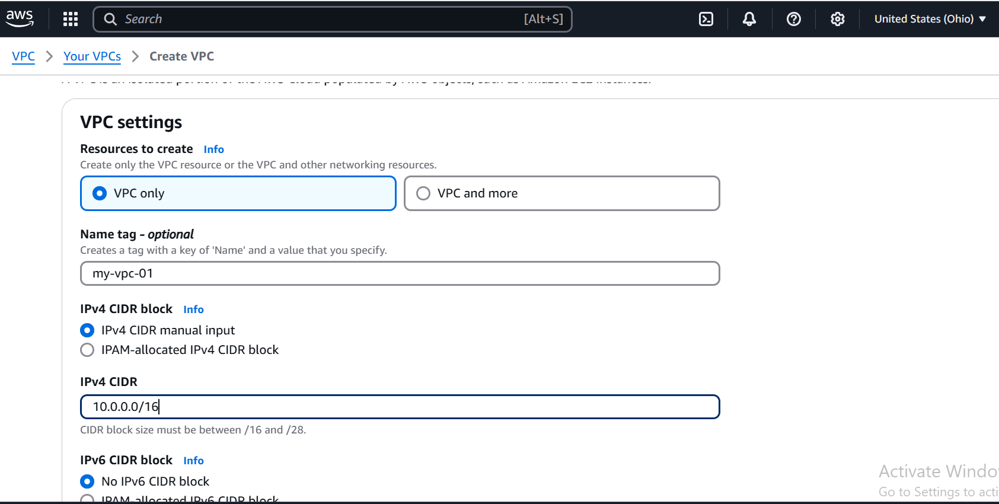
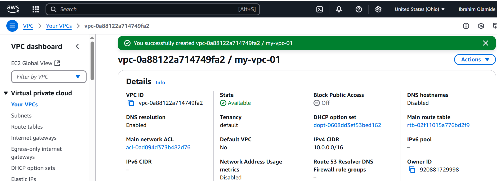

### Part 2 - Configuring Subnets within the VPC
* By the left, click subnets --> create subnet --> select the VPC you just created --> subnet name: my-public-subnet-01 --> Availability zone: click dropdown and select one zone --> IPv4 subnet CIDR block: 10.0.6.0/24
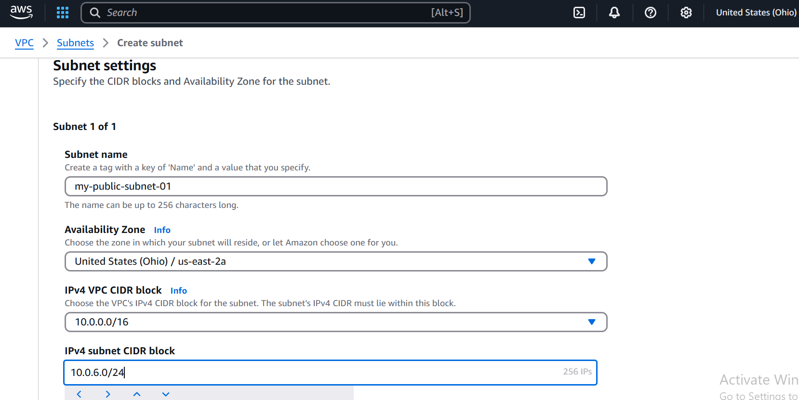
* Repeat same process for the second subnet, but a private subnet. Choose the availability zones and IPv4 subnet CIDR block being 10.0.8.0/24
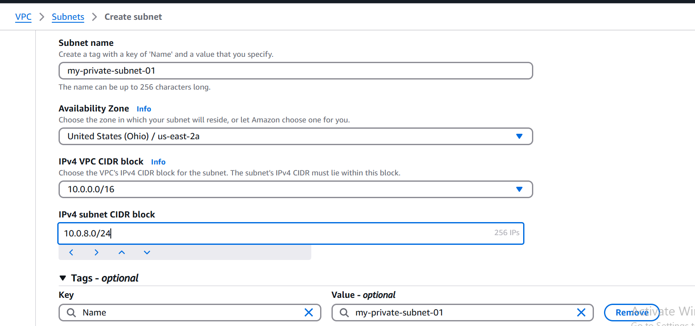
* Create subnet
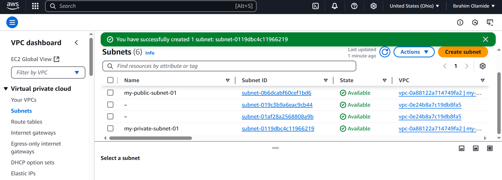

### Part 3 - Creating internet gateway and attaching it to the VPC
* By the left, select internet gateway --> create internet gateway --> name: my-internet-gw01 --> create internet gateway
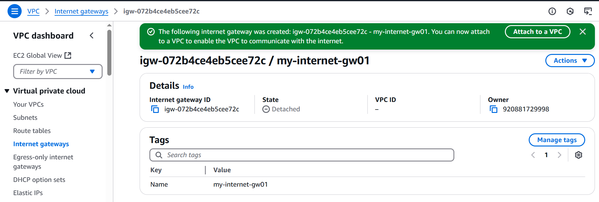
* To enable internet connectivity, you must attach the internt gateway to the VPC created earlier. click on actions --> attach to VPC --> select your VPC --> attach internet gateway
 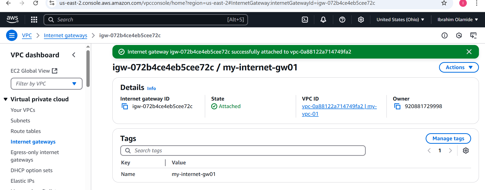

### Part 4 - Enabling Internet Connectivity with the Internet Gateway by Setting up Routing Tables
* By the left, click on Route Tables --> Create route tables --> name: my-route-table-01 --> select the VPC --> create route table
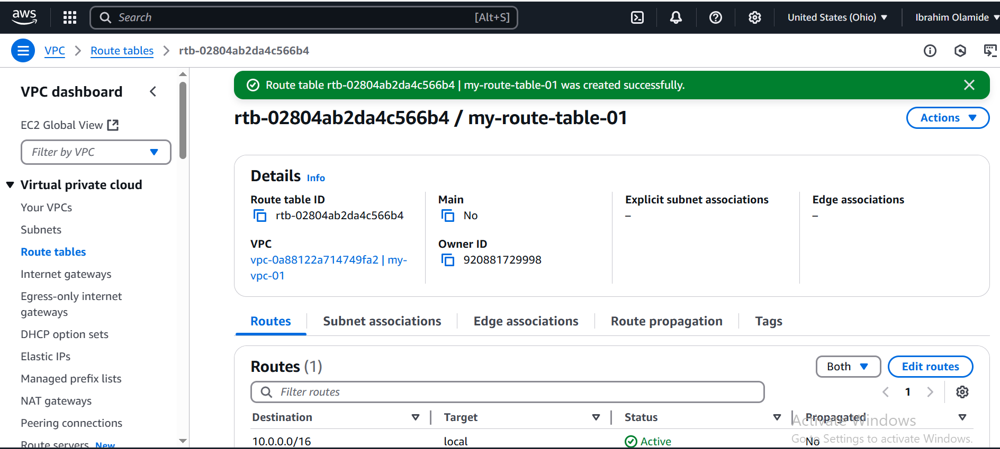
* Next is associating the subnet with this route table. click on subnet association --> Edit subnet association --> select the subnet you want to associate: my-public-sunet-01 --> save association
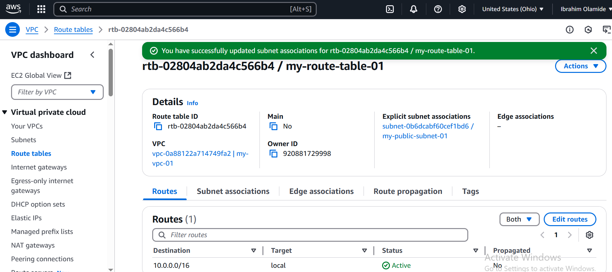
* Navigate to routes tab --> edit routes --> add route --> Destination: 0.0.0.0/0 (indicating that IPv4 address can access this subnet) --> Target: select the internet gateway you created --> save change
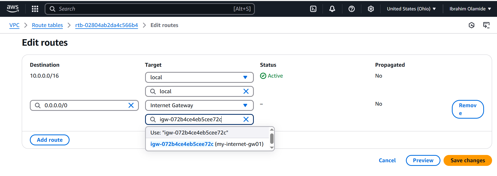
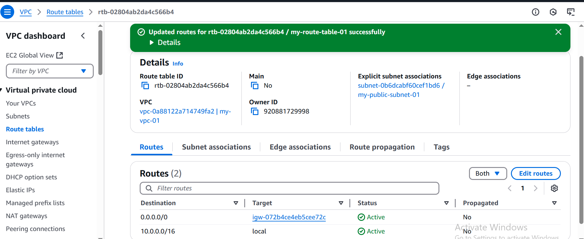

The route table has now been configured to route traffic to the internet gateway, allowing connectivity to the internet. Since only the subnet, my-public-subnet-01 is associated with this route table, only resources within that subnet can access the internet.

### Part 5 - Enabling Outbound Internet Access through NAT Gateway (by attaching NAT Gateway to the subnet and attaching the route table)
* By the left, click NAT gateways --> create NAT gateway --> name: my-nat-gateway-01 --> select subnet: my-private-subnet-01 --> connectivity type: private --> create NAT gateway
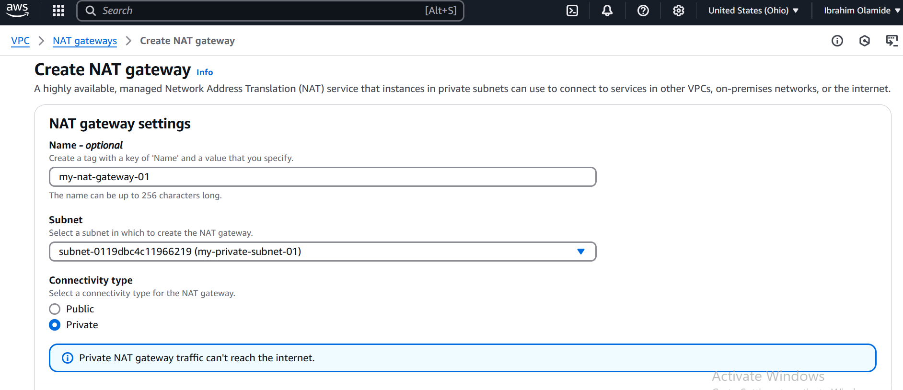
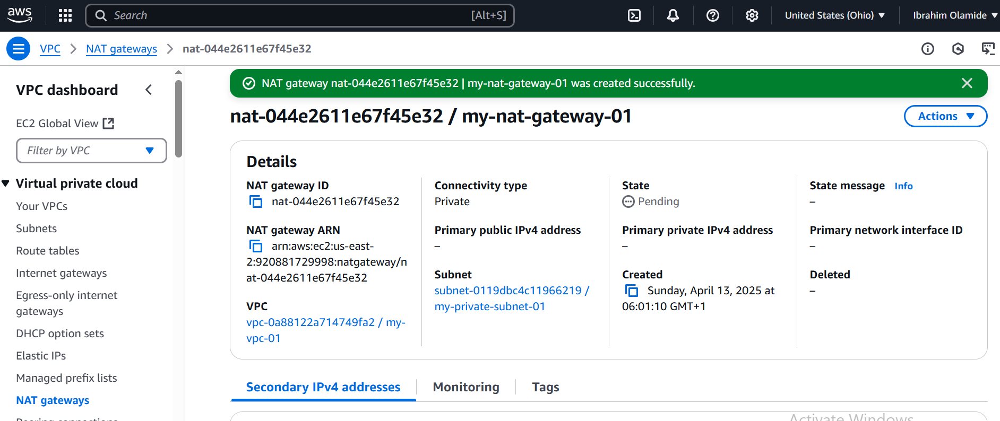
* Select NAT gateway --> Details tab --> scroll down and click the subnet ID --> click on the my-private-subnet-01 --> click on route table tab
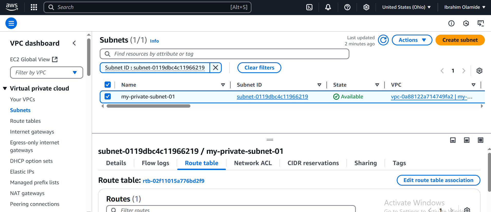
* click the route table ID --> select the ID box --> click on routes -->> edit routes -->> add routes --> Destination:0.0.0.0/0 --> target: NAT Gateway --> select the NAT gateway you created --> save the changes
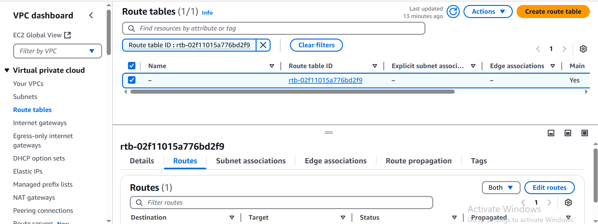
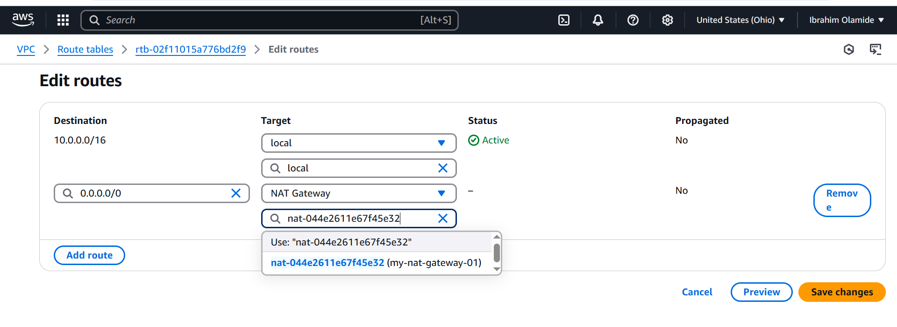
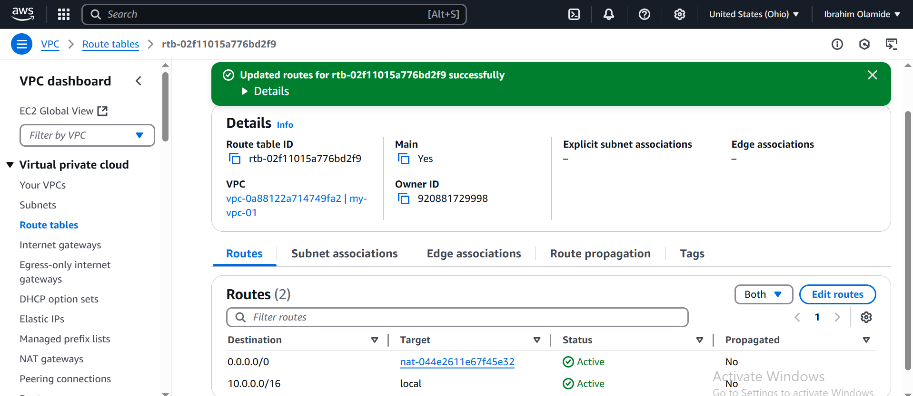
* Click Subnet association --> edit subnet association --> choose the private subnet --> save association. Now subnet has been successfully attached with the route table
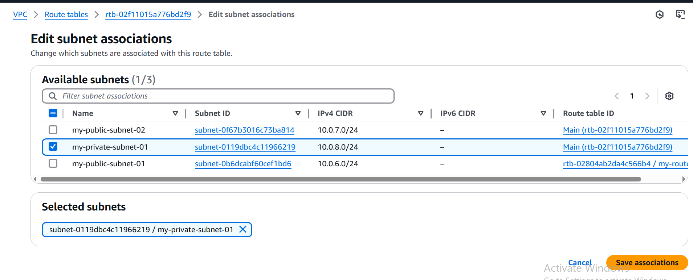
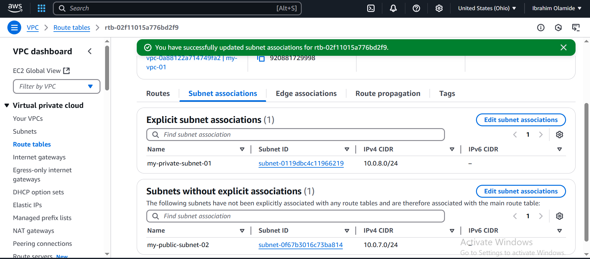

### Difference Between INternet Gateway and NAT Gateway
**Internet Gateway:** Think of it like a door to the internet for your subnet. When you attach an internet gateway to a subnet, it allows the resources in that subnet (like EC2 instances) to reach out to the internet and also allows internet traffic to reach those resources. Its like having a door both to enter and exit the subnet.
**NAT Gateway:** Imagine it as a one way street sign for your subnet traffic. When you attach a NAT gateway to a subnet, it lets resources in that subnet (like EC2 instances) access the internet, but it doesnt allow incoming traffic from the internet reach those resources. Its like the resources can go out to the internet but internet traffic cant directly come in.

### Part 6 - Establishing VPC Peering Connection
### What is VPC Peering: 
VPC peering is like connecting two virtual offices in the cloud so they can talk to each other directly. Just imagine two neighboring offices sharing files and chatting without going through a middleman.
* By default, EC2 instances in different VPCs cannot communicate with each other
* To enable communication between EC2 instances in different VPCs, you can setup VPC peering, VPN connections, or AWS direct connect.
* VPC peering establishes a direct network connection between the VPCs, allowing EC2 instances in one VPC to communicate with EC2 instances in other VPC.

### The need for VPC Peering
We need VPC peering when we want different parts of our cloud networks (VPCs) to work together smoothly. Maybe there is one VPC for your development team and another VPC for your marketing team and you want them to share data securely. Thats where VPC peering comes in handy - it lets these VPCs communicate directly, making things easier for everyone.

### Note the Following:  
* Two VPCs cannot connect to each other. You need to setup VPC peering or use VPN or direct connect to establish connectivity between VPCs
* Subnets within thesame VPC can communicate with eachother by default. AWS sets up route tables to allow communication within thesame VPC
* EC2 instances in thesame subnet can communicate with eachother by default, assuming they have proper security group rules allowing the desired traffic
* EC2 instances in different subnets within thesame VPC can also communicate with eachother by default, as long as their associated route tables are configured to allow traffic between subnets.

## VPC Peering Steps

* Lets begin by creating two VPCs in thesame region. Altrenatively, you can choose different region if needed.
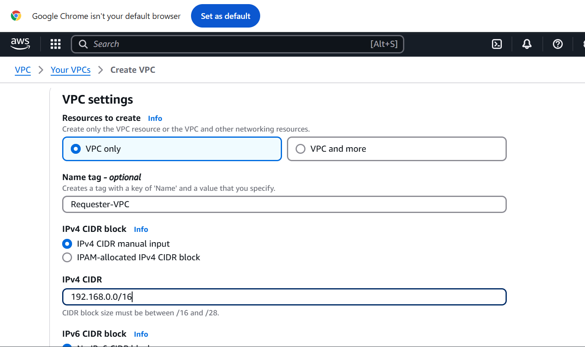
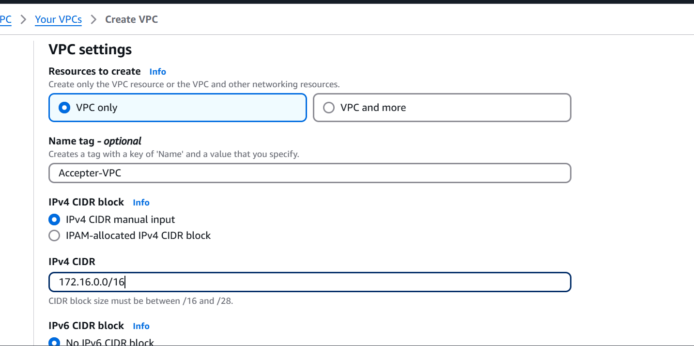

* By the left side bar, click peering connection --> Create peering connection --> peering name: VPC-peering-01 --> select the requester-VPC --> Account: my account --> Region: this region --> create peering connection
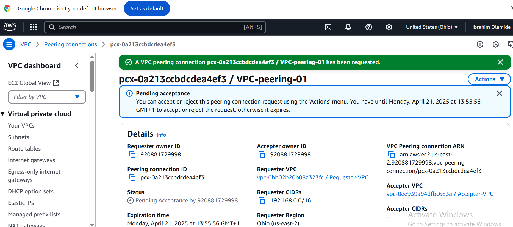

* To accept peering connection request, click on options --> accept request
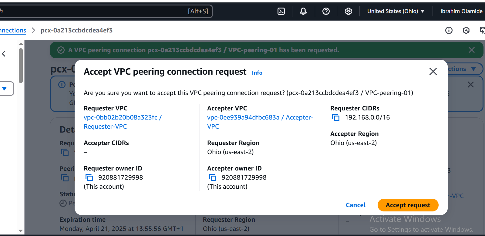
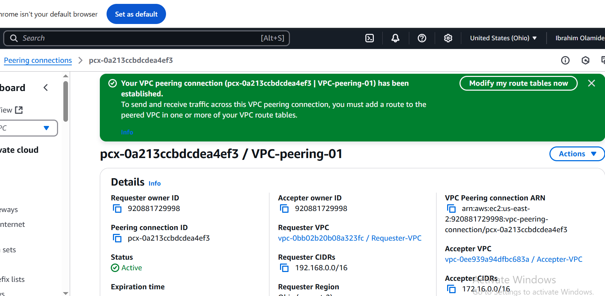

* Now goto your VPC list, scroll to the right under main route table, click on the route table ID for the accepter-VPC --> under the Routes tab --> edit route --> Add route --> destination: fill in the requeter IP address --> Target: choose your peering connection --> save changes
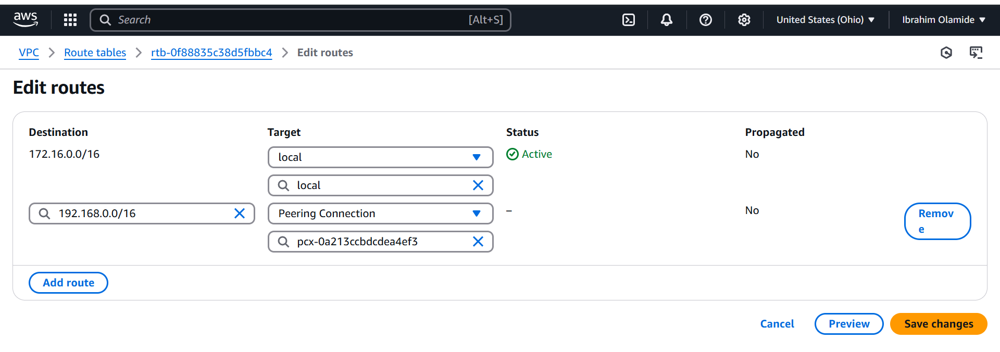

* Repeat this same process for the requester route table. Click on the requester route table ID --> under the Routes tab --> edit route --> Add route --> destination: fill in the accepter IP address --> Target: choose your peering connection --> save changes
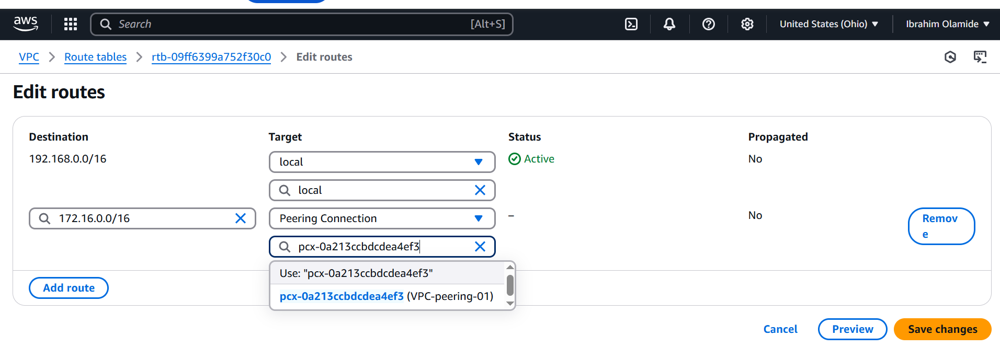

Now the connection between the two VPCs has been successfully established. Resources in the requester VPC can now connect with the resources in the accepter VPC and vice versa.

### What Is a VPC Endpoint?

Think of a VPC endpoint as a private shortcut inside your AWS environment that lets your VPC talk to AWS services without using the public internet.

### Imagine This Story:

You're in a secure office building (your VPC), and you want to send documents to Amazon S3 (a storage service). You have 2 options:
* Go outside the building and walk through public roads (i.e., use the internet) — risky and slow.
* Use a private tunnel from your office directly into Amazon’s office — safe and fast.

### That private tunnel is the VPC Endpoint.
### Why Use It?
* More secure (no need to go through the public internet)
* Faster and more reliable
* Can work without an internet gateway, NAT gateway, or public IPs

### Real Use Case Example:

Let’s say you're using EC2 in a private subnet. You want it to access S3 to download or upload files, but you don’t want to use a NAT Gateway or Internet Gateway.
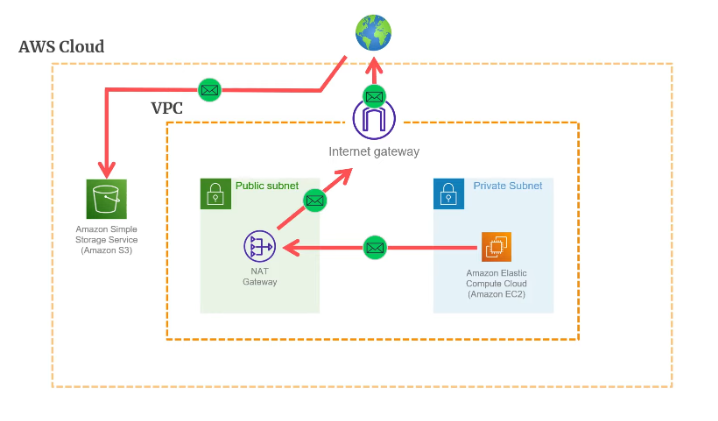

Solution: Create a VPC Gateway Endpoint for S3.

### Done! EC2 can now access S3 privately, without ever touching the public internet.
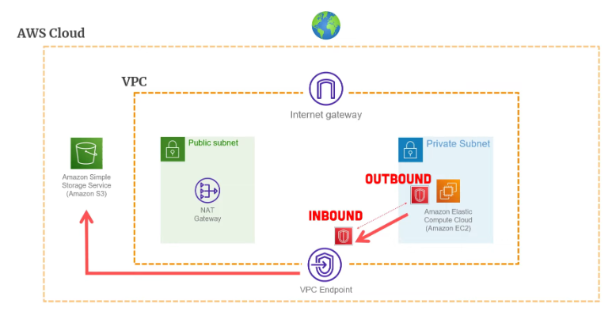

